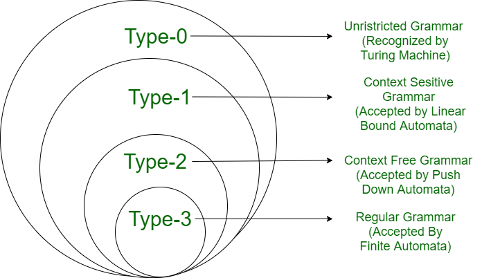

## Grammar and Languages 

In theory of computatiion grammer can e defined as a finite set of formal rules thad are generating  syntatically corrcet sentences.

### Context Free Grammar

is formal grammar, the syntax or structure of a formal language can be described using context-free grammar (CFG), a type of formal grammar. The grammar has four tuples: (V,T,P,S).

V - It is the collection of variables or non-terminal symbols(`Capital` letters).

T - It is a set of terminals(Small letters). (V intersection T = fi)

P - It is the production rules that consist of both terminals and non-terminals.

S - It is the starting symbol.

## CFL -> CFG

- a^n.b^n (n>=0) ==> S-->aSb/lamda
- a^n.b^n (n>0) ==> S-->aSb/ab
- a^n.b^(n+2)  ==> S-->aSb/bb
- a^(2n).b^n (n>=0) ==> S-->aaSb/l
- a^(2n+3).b^n (n>=0) ==> S-->aaSb/aaa
- a^m.b^n (m>n, m,n>=0) ==> S-->AS1

                            S1-->aS1b/lamda

                            A-->aA/a
- a^m.b^n (m>=n, m,n>0) ==> S-->AS1

                            S1-->aS1b/ab

                            A-->aA/lamda                            
- { w |  n(a)=n(b) } ==>    S--> aSb/bSa/`SS`/lamda
- {ww^r union w(a+b)w^r } (Palindrome) ==> S-->aSb/bSa/a/b/lamda
- a^n.b^n.c^m (m,n>=0) ==> S -->S1C

                           S1-->aS1b/lamda

                           C -->cC/lamda
- a*b* =  aS/Sb/ep
- (a+b)* = aS/bS/ep

## Left Most & Right Derivations :  Derivation tree 

- Left Most : Start with left first

eg if aaaabb belongs to S-->AB

                        A-->aaA/lamda

                        B-->bB/lamda

==> Make left most tree .

eg: 

S-> aS/Sb/ep

to derive `aab` 

  S-> aS->aaS->aaSb->aaEb->aab

  and Make Derivation tree also.

- Right Most : Start with Right first

## Ambguity

A grammar is ambiguous if at least one string can be generated by more than one distinct parse tree or leftmost derivation. Ambiguity causes multiple syntactic interpretations for the same string, which is undesirable, especially in programming languages, because it leads to confusion over the intended structure or meaning.

eg :

## Elimaination of Null(epsilon) Production 

eg S-->aS/A

A-->epsilon.

=> Nullable variables = {A,S}    ~ bcx S-->A-->epsilon

=> S-->aS/A/a/epsilon

or S-->aS/a/epsilon

ii). S-->ABC

     A-->aA/E

     B-->bB/E

     C-->c

==> Nullable variables = {A,B} .

    S-->ABC/BC/AC/C

    A-->aA/a

    B-->bB/b

    C-->c

## Closure Properties of CFL (Context Free Languages)    

Union ie S1/S2 is CFL

Catenation ie S1.S2 is CFL

Kleen Closure ie S-->S1S/e (all combinations of s1) is CFL

Intersection is not CFL

Complementation is not CFL

## Chomsky classification of grammar

According to Chomsky hierarchy, grammar is divided into 4 types as follows: 

- Type 0 is known as unrestricted grammar.
- Type 1 is known as context-sensitive grammar(CSG)
- Type 2 is known as a context-free grammar(CFG)
- Type 3 Regular Grammar.



# Chomsky Classification of Languages

The **Chomsky Hierarchy** classifies formal languages into four types, based on the type of grammar and computational model required to generate or recognize them.

---

## **Type-0: Recursively Enumerable Languages**

- **Grammar:** *Unrestricted Grammar*
    - Production rules are of the form:

      ```
      α → β
      ```

      where `α` and `β` are strings of terminals and/or non-terminals, and `α ≠ ε` (empty string).
    - No restrictions on the structure of rules.
- **Automaton:** *Turing Machine*
    - Recognizes all computable languages.
    - May not halt for some inputs.
- **Characteristics:**
    - Most general class of languages.
    - Some languages may be undecidable.

### Example:

A grammar for the language \( L = \{a^n b^n c^n d^n \mid n \geq 1\} \):

---

## **Type-1: Context-Sensitive Languages**

- **Grammar:** *Context-Sensitive Grammar*
    - Production rules are of the form:

      ```
      αAβ → αγβ
      ```

      where `A` is a non-terminal, and `γ` is a non-empty string.
    - The length of the right-hand side (`γ`) is always greater than or equal to the left-hand side (`αAβ`).
- **Automaton:** *Linear Bounded Automaton* (Turing Machine with bounded tape length).
- **Characteristics:**
    - Subset of Type-0 languages.
    - Recognizable in finite space.
    - No ambiguity arises from rules being dependent on context.

### Example:

A grammar for the language \( L = \{a^n b^n c^n \mid n \geq 1\} \):


---

## **Type-2: Context-Free Languages**

- **Grammar:** *Context-Free Grammar*
    - Production rules are of the form:

      ```
      A → γ
      ```

      where `A` is a single non-terminal, and `γ` is a string of terminals and/or non-terminals.
- **Automaton:** *Pushdown Automaton* (uses a stack for memory).
- **Characteristics:**
    - Subset of Type-1 languages.
    - Commonly used in programming language parsers and compilers.

### Example:

A grammar for the language \( L = \{a^n b^n \mid n \geq 0\} \):


---

## **Type-3: Regular Languages**

- **Grammar:** *Regular Grammar*
    - Production rules are of the form:

      ```
      A → aB
      A → a
      ```

      where `A` and `B` are non-terminals, and `a` is a terminal.
- **Automaton:** *Finite Automaton* (no additional memory apart from states).
- **Characteristics:**
    - Subset of Type-2 languages.
    - Can be represented using regular expressions.
    - Efficiently implementable for tasks like lexical analysis.

### Example:

A grammar for the language \( L = \{a^n b^m \mid n, m \geq 0\} \):

# Simplifying Context Free Grammars

1. Useless productions – The productions that can never take part in derivation of any string , are called useless productions. Similarly , a variable that can never take part in derivation of any string is called a useless variable. For eg. 

eg :S -> abS | abA | abB

    A -> cd

    B -> aB

    C -> dc                         

- C -> dc’ is useless because the variable ‘C’ will never occur in derivation of any string.
- Production ‘B ->aB’ is also useless because there is no way it will ever terminate . `If it never terminates , then it can never produce a string`. Hence the production can never take part in any derivation. 

modified : S -> abS | abA

           A -> cd

2. Elimination of unit Production : 

eg    A->B , B->C , C->a 

==> A->a , B->a , C->a

eg S->aA/B

   A->ba/bb

   B->A/bba

Modified : 

   S->aA/ba/bb/bba

   A->ba/bb

## Chomsky Normal Form 

A context free grammar (CFG) is in Chomsky Normal Form (CNF) if all production rules satisfy one of the following conditions:

A non-terminal generating a terminal (e.g.; X->x)

A non-terminal generating two non-terminals (e.g.; X->YZ)

Start symbol generating ε. (e.g.; S-> ε)

A-> BC

or A->a

- No of steps = 2n-1.

## Context Free Grammar to Chomsky Normal Form (CFG To CNF)

1. Eliminate start symbol from RHS.

If start symbol S is at the RHS of any production in the grammar, create a new production as:

{S0->S}

where S0 is the new start symbol.

2. Eliminate null => replace with epsilon for rach .

- unit ==> 

    if C-> B ==> replace B with what B tends to iff B doesnt tend to other unit pair.
- and useless productions ==> remove non-genertaing symbols.

3. Eliminate terminals from RHS if they exist with other terminals or non-terminals. 

- e.g: production rule X->xY can be decomposed as:

X->ZY

Z->x ( Z is `cascade` symbol)

4. Eliminate RHS with more than two non-terminals.

- e.g,; production rule X->XYZ can be decomposed as:

X->PZ

P->XY

- A->aBC=> XBC =>YC  ---` Staircase approach `

=> X->a

=> Y=>XB

- A->aBc 

eg :

S-> ABA 

A-> aA/E

B-> bB/E

1. Remove Null p

S-> ABA/AB/BA/AA/B/A/E