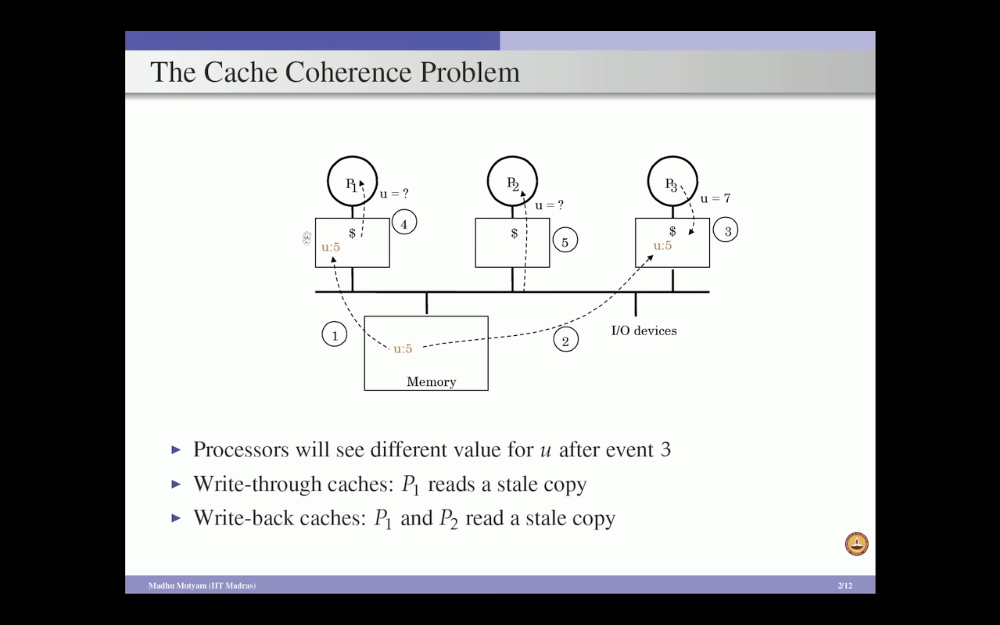

# Cache Coherence : 
Cache coherence refers to the consistency and synchronization of data stored in different caches within a multiprocessor or multicore system.
- a core is a small CPU or processor built into a big CPU or CPU socket.
• Write-through: The cache controller writes to both the cache and main memory at the same time. it can slow down application performance.
• Write-back: The cache controller writes to the cache only, and then moves the data to main memory or disk later.

CC in Write-Through : Data is update in Private Cache 1 and Main Memory only but not in Private Cache ==> CC problem

 -- Cache Coherence 
  -- Cache Coherence write through and write back  

### A memory system is `Coherent` iff it returns the most recently updated value of a data item  or 
1. `Write N , X (i)` ie Write N to X in a n-core device by ith core .
    `Read X (i)`
2.  `Read X (i)`
    `Write N , X (j)`
3. `Write N ,x (i)` 
   `Write N ,x (j)`

  -- Enforcing Coherence

- invalidation ==> deletes the data in other private caches
**Snoop-based C protocol** : For 4 or 8 core processprs
A snoop-based protocol, also known as a `bus-snooping protocol`, is a method for maintaining cache coherency in a multiprocessor system. It uses a shared bus to connect all the caches and the main memory. When a processor writes to its cache, it broadcasts the address of the modified block to the bus. Other processors then check if they have a copy of the block and update or invalidate it as needed. 
- Controller updates state of all the cache blocks whenever a Cache transition occours.
**MSI**
The MSI Protocol is a snooping-based coherence protocol used in multiprocessor systems with write-back caches. It uses three states: Modified (M), Shared (S), and Invalid (I), to maintain cache coherence when multiple processors access the same data.

**Directory-based cache coherence protocol** 
is a mechanism used to manage cache coherence in multicore systems. It uses a centralized directory to keep track of the state of each cache line across multiple caches. This approach helps ensure data consistency by maintaining a global view of which caches hold copies. 
