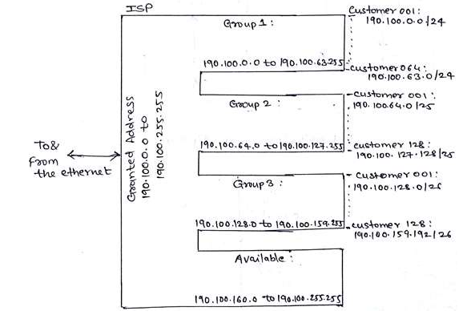

##  A TCP message consisting of 2100 bytes is passed to IP for delivery across two networks. The first network can carry a maximum payload of 1200 bytes per frame, and the second network can carry a maximum payload of 400 bytes per frame, excluding network overhead. Assume that IP overhead per packet is 20 bytes. What is the total IP overhead in the second network for this transmission?

- TCP (or transport layer ) sends 2120 Bytes to Network layyer.
-  Network layers seprates 20 bits of IP.
- Fragmentations starts.
- payload = 1200bytes excluding network overhead  => MTU(Maximum Transmission Unit ) = 1220.

## The transport layer protocols used for real-time multimedia, file transfer, DNS, and email, respectively, are:
(A) TCP, UDP, UDP, and TCP
(B) UDP, TCP, TCP, and UDP
(C) UDP, TCP, UDP, and TCP
(D) TCP, UDP, TCP, and UDP
Justify your answer.

#### To identify the correct transport layer protocols for the given scenarios:

Scenarios:
Real-time multimedia
Uses UDP because it prioritizes low latency over reliability. Real-time applications like live video streaming or VoIP tolerate some data loss but require minimal delay.
File Transfer
Uses TCP because it ensures reliable, ordered, and error-checked delivery of data, which is essential for file integrity.
DNS (Domain Name System)
Primarily uses UDP to resolve domain names quickly with minimal overhead. However, TCP is also used for specific cases like zone transfers or messages exceeding 512 bytes.
Email
Uses TCP (e.g., protocols like SMTP, IMAP, and POP3 rely on TCP) to ensure reliable and ordered delivery of messages.

## 

##
1. Physical Layer
Name of the Data Unit: Bits
The physical layer works with raw bits (0s and 1s) that are transmitted over a physical medium.
Addressing Scheme Used:
No specific addressing is used at this layer.
It focuses on the physical medium characteristics and does not require an address.
Device Used:
Examples: Hubs, Repeaters, Cables (coaxial, fiber optic, etc.), Connectors, Switches (Layer 1).
These devices are responsible for electrical, optical, or radio signal transmission.
Delivery of Data:
From: Network Interface Controller (NIC).
To: Physical medium (e.g., cable, wireless signals).
It ensures the actual transmission of bits over the physical link between devices.
2. Data Link Layer
Name of the Data Unit: Frames
At this layer, the bits are grouped into frames, which are manageable blocks of data.
Addressing Scheme Used:
MAC Addresses (Media Access Control) are used to identify devices uniquely at this layer.
Example: 00:1A:2B:3C:4D:5E.
Device Used:
Examples: Switches (Layer 2), Bridges, Network Interface Cards (NIC).
These devices help in transferring frames within a local network.
Delivery of Data:
From: One node to another in the same network (via the physical medium).
To: Next node (directly connected node).
This layer ensures error detection, frame synchronization, and flow control.
3. Network Layer
Name of the Data Unit: Packets
Data is encapsulated into packets at the network layer, which includes logical addressing and routing information.
Addressing Scheme Used:
IP Addresses (logical addresses) are used for identifying the source and destination.
Example: IPv4 (192.168.1.1) or IPv6 (2001:db8::1).
Device Used:
Examples: Routers, Layer 3 Switches.
These devices are responsible for packet forwarding and routing across different networks.
Delivery of Data:
From: Source network (e.g., sender's LAN).
To: Destination network (e.g., receiver's LAN).
This layer handles logical addressing, fragmentation, and path selection.
4. Transport Layer
Name of the Data Unit: Segments (in TCP) or Datagrams (in UDP)
Data from the upper layers is split into segments (TCP) or datagrams (UDP).
Addressing Scheme Used:
Port Numbers are used to identify specific processes/services on the source and destination devices.
Example: Port 80 for HTTP, Port 443 for HTTPS.
Device Used:
This layer operates end-to-end between devices and does not require physical devices like switches or routers.
Software entities (e.g., operating system services) implement this layer.
Delivery of Data:
From: One application/process on the source machine.
To: Corresponding application/process on the destination machine.
This layer ensures reliable data transfer (TCP) or faster, connectionless communication (UDP).

Summary Table
Layer	        Data Unit	        Addressing Scheme	        Device Used	Delivery
Physical	    Bits	            None	Hubs, Cables	    NIC ↔ Physical medium
Data Link   	Frames	            MAC Address	Switches, NICs	Node ↔ Node (same LAN)
Network	        Packets	            IP Address	Routers	Source  Network ↔ Destination Network
Transport   	Segments/Datagrams	 Port Numbers OS Software 	Application ↔ Application

