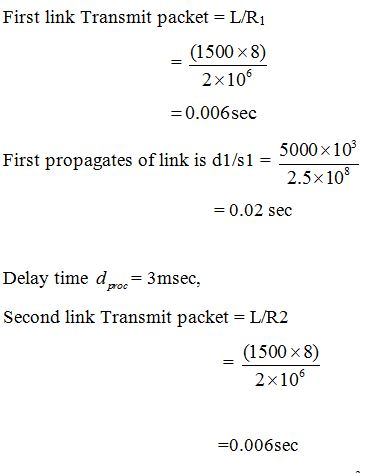
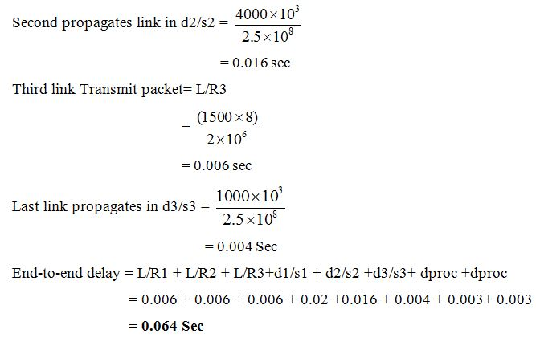

##  Consider a message having length, five times greater than the network can handle. So, it has
been fragmented into five equal size datagrams and send to the destination. Each datagram
follows a different path as given in the table:
Datagram Path length Visited switches
1 3,500 km 1,2,5
2 12,500 km 1,3,5
3 13,200 km 1,3,2,5
4 10,700 km 1,4,3,5
5 11,200 km 1,4,5
Assume the delay at each switch is 3, 10, 23, 8 and 16 msec respectively and the
propagation speed is 2*108m/sec. Calculate the total delay for each datagram and the order
they arrive at the destination.

## Consider a network having a bandwidth of 1 Mbps. A message of size 1000 bytes has to be sent using packet switching. Each packet contains a header of 100 bytes. In how many packets must the message be divided to ensure the total time taken is minimum (ignoring propagation delay)?
 

## Question:Consider a packet of length 1,500 bytes, which begins at end system A and travels over three links to a destination end system. These links are connected by two packet switches. The propagation speed on all the links is  2.5 × 1 0 8 2.5×10  m/s, and the transmission rates of all three links are 2 Mbps. The packet switch processing delay is 3 ms. lengths of the links are:

First link: 5,000 km
Second link: 4,000 km
Third link: 1,000 km

hree links are connected by two packet switches 
 
 
> 2 times dpoc will be added i.e 3msec*2 = 0.006 sec

Tt = L/R = 1500 bytes/ 2Mbps = 0.006 sec

for three links 6ms*3 = 18ms

and now Tp is individually calculated as they are different 

Tp= D/S 

Tp1 = 5000km/(2.5X10^8 m/sec) = 0.020 sec

Tp2 = 4000km/(2.5X10^8 m/sec) = 0.016 sec

Tp3 = 1000km/(2.5X10^8 m/sec) = 0.004 sec

adding all we get

0.018+0.006+0.020+0.016+0.004= 0.064 sec = 64msec 

- To calculate the end-to-end delay for a packet traveling over the given three links, we need to account for:

Transmission delay for each link
Propagation delay for each link
Switch processing delay

## Differences Between Packet Switching (Connection-Oriented) and Circuit Switching
| **Aspect**              | **Packet Switching (Connection-Oriented)**                                    | **Circuit Switching**                                  |
|-------------------------|-------------------------------------------------------------------------------|------------------------------------------------------|
| **Connection Setup**    | Logical connection established at the start, but no dedicated physical path. | Dedicated physical path is established before data transfer. |
| **Resource Allocation** | Resources are shared among multiple users; no single path is reserved.       | Resources are reserved for the duration of the connection. |
| **Efficiency**          | High efficiency; network bandwidth is utilized dynamically by multiple connections. | Inefficient; resources remain idle if no data is transmitted. |
| **Data Transmission**   | Data is sent in packets; packets may take different routes but are reassembled at the destination. | Data is sent as a continuous stream along the reserved path. |
| **Reliability**         | Uses acknowledgments and retransmissions for reliability.                    | Reliability is inherent due to the dedicated path. |
| **Flexibility**         | Highly flexible; supports dynamic routing.                                   | Limited flexibility; fixed route cannot adapt to failures easily. |
| **Cost**                | Lower cost; no need to maintain dedicated links.                             | Higher cost due to resource reservation. |
| **Examples**            | TCP/IP, VoIP (Voice over IP), HTTP.                                          | Traditional telephone networks. |
