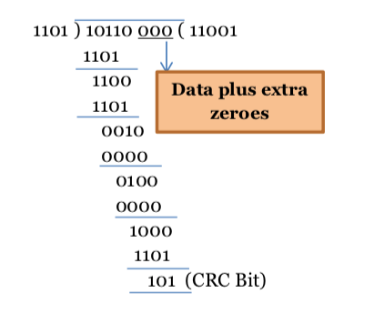

# Design a TST (Time-Space-Time) switch with 36 inputs and 36 outputs. Assume that 25% of the users are usually active at a time. Calculate minimum number of cross points needed in this scenario. Compare this scenario with the situation when only one cross bar switch is used for all input and output connections.
Stage 1 - Time Switch (Input side):

<!-- Each input can use up to 9 active time slots (since 25% users are active).
Each input switch connects 9 active slots to a space switch (instead of all 32 slots).
Total crosspoints for Time Switches:

 𝑁
×
9
=
36
×
9
=
324
 
crosspoints
N×9=36×9=324crosspoints
Stage 2 - Space Switch:

A space switch connects active channels from input to output.
There are 9 active inputs from each input line to connect to any of the 36 outputs.
The required crosspoints for the space switch:
9
×
36
=
324
 
crosspoints
9×36=324crosspoints
Stage 3 - Time Switch (Output side):

Similar to the input side, we need 36 time switches, each with 9 active channels.
Total crosspoints for Time Switches (Output side):

𝑁
×
9
=
36
×
9
=
324 crosspoints
N×9=36×9=324crosspoints
Total Crosspoints for TST Switch:

324
+
324
+
324
=
972
 
crosspoints
324+324+324=972crosspoints
Single Crossbar Switch Calculation:
A single crossbar switch must connect all 36 inputs to all 36 outputs directly.
Crosspoints required for a single crossbar switch:
36
×
36
=
1296
 
crosspoints
36×36=1296crosspoints -->

# In a TDM medium access control bus LAN, each station is assigned one time slot per cycle for transmission. Assume that the length of each time slot is the time to transmit 100 bits plus the end to end propagation delay. Assume a propagation speed of 2 * 10^8m/sec. The length of the LAN is 10 km with a bandwidth of 1 Mbps. Find the maximum number of stations that can be allowed in the LAN so that the throughput of each station can be 1/3 Mbps.

Propagation delay = (LAN length / Propation speed) = 1000/2*10^8 = 50 * 10^-6
Time to transmit 100 bits: 100bits/1Mbps = 100 * 10^-6 s ;
Total = 150 micros
Let there are maximum N number of station then Length of cycle is N*150us
In a whole cycle each user transmit for 10us only 
Therefore efficiency is (100/150N)
Throughput of each station (100/150N)*1 Mbps = 2/3N Mbps
which is given as 1/3 Mbps = 2/3N => {N=2}
https://www.youtube.com/watch?v=9A9uAJHHlHo

# Station A needs to send a message of 12 packets to station B using a sliding window (window size 4) and Go- back-N error control strategy. All packets are ready and immediately available for transmission. If every 4th packet that A transmits get lost (but no acknowledgement form B ever get lost), then what is the number of packets that A will transmit for sending the message to B?

Whole window gets discarded after 1 packet is lost = > But count them as being sent 
 

1. Character count: 
The frame has 5 characters, so the character count is 5.
5=00000101
Transmitted bit sequence:
Count (5)+A+B+FLAG+ESC+FLAG
00000101 0100111111000011011111101111100001111110

2. Flag Bytes with Byte Stuffing :
Transmitted bit sequence:
FLAG+A+B+ESC+FLAG+ESC+ESC+FLAG
0111111001001111110000111111100001111110111110001111100001111110

3. Starting and Ending Flag Bytes with Bit Stuffing
Transmitted bit sequence:
FLAG+A+B+Bit-stuffed FLAG+ESC+Bit-stuffed FLAG+FLAG
011111100100111111000011011111001011111000011111001001111110
Bit stuffing rule: If 5 consecutive 1s appear in the data, a 0 is inserted after those 5 1s to avoid accidentally detecting a FLAG byte.

# A system is generating frame at the rate of 80Mbps, while the rate of the receiver is 8Mbps for sending acknowledgement. Size of the frame and acknowledgement are 500 bytes and 50 bytes respectively. The round trip delay is 100 μs. Calculate the throughput for stop and wait ARQ.

Total cycle time=50μs+100μs+50μs=200μs
Throughput= Useful frame transmission time/Total cycle time = 50/200= 0.25
Effective Throughput=0.25×80Mbps= {20Mbps}

# Suppose the data arrived at the receiver is FC6. Now, by using some error detecting technique, check whether the received data is error free or not. If not, then determine the original data.

1111 1100 0110
F    C    6
P0 = 4
P1 = 5 ==> wrong 
P2 = 2
P3 = 5 ==> wrong 
1010 ==> 10th is wrong 

# SWitching question 

# GoBackN ARQ protocol 
A 1 Mbps satellite link connects two ground stations. The altitude of the satellite is 36504 km and speed of the signal is 3 x 108 m/sec. What should be the packet size for a channel utilization of 25% for a satellite link using go back 127 sliding window protocol?

120 bytes
60 bytes
240 bytes
90 bytes
 

Solution-
 

Given-

Bandwidth = 1 Mbps
Distance = 2 x 36504 km = 73008 km
Propagation speed = 3 x 108 m/sec
Efficiency = 25% = 1/4
Go back N is used where N = 127
 

Let the packet size be L bits.

 

Calculating Transmission Delay-
 

Transmission delay (Tt)

= Packet size / Bandwidth

= L bits / 1 Mbps

= L μsec

 

Calculating Propagation Delay-
 

Propagation delay (Tp)

= Distance / Speed

= (73008 x 103 m) / (3 x 108 m/sec)

= 24336 x 10-5 sec

= 243360 μsec

 

Calculating Value of ‘a’-
 

a = Tp / Tt

a = 243360 μsec / L μsec

a = 243360 / L

 

Calculating Packet Size-
 

Efficiency (η) = N / (1+2a)

Substituting the values, we get-

1/4 = 127 / (1 + 2 x 243360 / L)

1/4 = 127 x L / (L + 486720)

L + 486720 = 508 x L

507 x L = 486720

L = 960

 

From here, packet size = 960 bits or 120 bytes.

Thus, Correct Option is (A).

# Consider a selective repeat sliding window protocol that uses a frame size ofl KB to send data on a 1.5 Mbps link with a one-way laiency of 50 msec. To achieve a link utulization ot U0, Caleulate the minimum number of bits required to represent the sequence number field?

Sequence number >= Sender window size + Reciever Window size (2*SWS)
> n=SWS/(1+2a) find SWS 
Log(2SWS)= no of bits req

# Delay + propagation

# 
Total time = Transmission-Time + 2* Propagation-Delay + Ack-Time.
Throughput = L/Total Time
           = 500/0.2
           = 2500 bytes/sec.

# Consider the cyclic redundancy check ((CRC) based error detecting scheme having the generator polynomial x"3-xt1. Suppose the message 1 1000 is to be transmitted. Check bits are appended at the end of the message by the transmitter using the above CRC scheme. Calculate the transmitted bit sequence.
 

# 
> Start from right side as lSB fro there .
Code is 1110 0100 1111

Now check Parity bit

P1=

P2=

P4=

P8=

So, Error in 2nd bit

original bit is 1010 0100 1111 =A4F

## Host A is sending data to Host B over a full duplex link. Both use sliding windows for flow control, with window sizes of 5 packets each. Data packets are 1000 bytes and take 50ms to transmit. Acknowledgement packets are negligible in size and transmission time. Propagation delay is 200ms.
 
-- for 1 delay => N packets are transferred .
