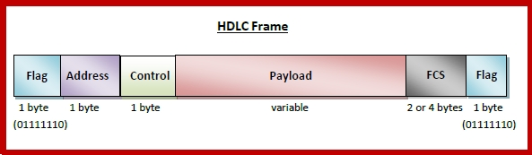
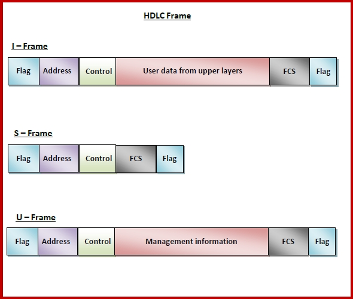

## Data Link Layer
- Network layer is responsible for source to source but DLL decides which next route it will reach first (switching) or hop to hop delivery.
- Flow control Flow control refers to a set of procedures used to restrict the amount of data that the sender can send before waiting for acknowledgment.
- Error control in hop to hop not source to destination (CRC)
- Acesses Control (ALOHA etc) => which devices send messages at what time.

6. Data Link.
a). Encodes & Decodes data packets sent by network layer called as `frames` & ensures no error in data packets.
b). uses 2 protocols i). HDLC(High level data link control). PPP (Point to point protocol).
c). divided into 2 sub layers i). MAC (media acess control) --Manages protocol access to the physical network medium. 
                              ii). LLC (Logic link control).--Handles error checking and flow control.
d). Responsible for adding headers and trailers to these frames .
e). Data Unit: Frames.
{The frame includes the source physical address 15 and the physical address of the router (gateway) 
    on the local network (obtained via ARP).}

# Framing
Frames are the units of digital transmission, particularly in computer networks and telecommunications. Frames are comparable to the packets of energy called photons in the case of light energy. Frame is continuously used in Time Division Multiplexing process. 

# Bit Stuffing 
- Bit stuffing is the process of adding one extra 0 whenever five consecutive 1s follow a 0 in the data, so that the receiver does not mistake the pattern 0111110 for a flag.
Example of bit stuffing – 
Bit sequence: 110101111101011111101011111110 (without bit stuffing) 
Bit sequence: 110101111100101111101010111110110 (with bit stuffing) 
> After 5 consecutive 1-bits, a 0-bit is stuffed.

## Byte Stuffing 
Byte stuffing is the process of adding 1 extra byte whenever there is a flag or escape character in the text.

## Error detection and Correction
1. Single bit error  e.g 1011 => 0011
2. Burst Error  >=2error  e.g 1011 => 0010   => 4 bit error between 1->4

# Detection 
1. Simple Parity or VRC(Vertical Redundancy Check) (Even , Odd) => Detects all single bit errors in data  or odd number of changes.
- add 1 if odd 1s alredy , else add 0 . => EVEN PARITY. 
Hamming distance(d) = XOR of any 2 valid codes (eg 1000 & 0000 ) , is `min 2` for all cases.
Can detect => d-1 errors.
2. 2D Parity Check or LRC (Longitudnal) => Multiple parity , table 
3. Check Sum 
Sender :
 - Divide bits into k blocks of n size each.
 - sum all k data blocks 
 - Add carry to sum such that size is =n
 - do 1's complement , append checksum to message 

 Reciever :
 -  adds all k blocks with checksum also
 - add carry again , if all bits are 1 => no error 

4. Cyclic Redundancy Check (CRC) => 
CRC uses `Generator Polynomial` which is available on both sender and receiver side. 
An example generator polynomial is of the form like x^3 + x + 1. This generator polynomial represents key 1011. Another example is x^2 + 1 that represents key 101. 
- Total bits send = n+k (n : Number of bits in data to be sent from sender side.  k : Number of bits in the key obtained from generator polynomial.)(degree)
-  XOR not subtract
> Divide Data word by Generator poly and append the remainder(last degree digits ) to the data word 
 => new valid data word , which when divide by generator poly gives remainder =0 

# Correction
1. Hamming Codes :
- All the bit positions that are a power of 2 are marked as parity bits (1, 2, 4, 8, etc).
The number of data bits = 7
The number of redundant bits = 4
The total number of bits = 7+4=>11
The redundant bits are placed at positions corresponding to power of 2 that is 1, 2, 4, and 8
|d3|d2|d1|p2|d0|p1|p0|
|7 |6 |5 |4 |3 |2 |1 |
- p2 = bits 4, 5, 6, 7 
- p1 bit is calculated using parity check at all the bits positions whose binary representation includes a 1 in the second position from the least significant bit. R2: bits 2,3,6,7,10,11 
- p0 bit is calculated using parity check at all the bits positions whose binary representation includes a 1 in the least significant position. 
p0: bits 1, 3, 5, 7, 9, 11
if any of the parity is not even => error
error will be at p2p1p0 (eg 110=>6th bit is error) 

## Flow Control Protocols types

# Stop and Wait ARQ Protocol
Stop and Wait ARQ (Alternating Bit Protocol) is a data transmission protocol used for reliable data transfer over noisy channels or links. It ensures that information is not lost due to dropped packets and that packets are received in the correct order.
2 Sequence numbers 0 & 1 => 
- Sender sends Frame 0 , recives Ack1 => Senders send Frame 1 , recieves Ack0 => loop
- if Frame 0 is lost => Sender waits till Timeout and restarts and Sends again Frame 0
- if Ack1 is lost => Sender waits and again sends same frame but reciever discards because has seq no = 1  , now sender again sends .
Efficency = **1/(1+2x) x=Tp/Tt** => Propagation delay (Tp) ,Tt(Transmission Time)

# Go-Back-N Automatic Repeat Request (ARQ) 
is a data link layer protocol used for data flow control purposes. It is a sliding window protocol, where multiple frames are sent from the sender to the receiver at once, depending on the window size (N). The protocol ensures reliable data transfer by retransmitting lost or corrupted frames.
Sender winndow size = 2^m -1 where m is the number of bits required to represent the sequence number.
Reciever window size = 1
- if Ack2 is lost => Sender send next seq no (ie Frame 2) if it gets Ack3 from return => reciever has recived frame 1 also.
- if Frame1 is lost => reciever will discard Frame2 also bcx its size=1 which is on seq no1
- Inorder bcx reciever size = 1 
Efficency = **(2^k -1)/(1+2x)**

# Selective Repeat ARQ (Automatic Repeat Request)
Sender winndow size = 2^(m-1) and Reciever also , where m is the number of bits required to represent the sequence number.
Out of order also excepted ie window size is 123 therefore anyone between 123 will be recieved.
Reciever window keeps sliding forward.
- If 2 is recieved and 1 has still not come => it will send NAK 1(Negative Acknowledgement 1).
- if ack1 is lost , it sends rest first and at end the lost ie frame 1 .

# HDLC
High-level Data Link Control (HDLC) is a group of communication protocols of the data link layer for transmitting data between network points or nodes. Since it is a data link protocol, data is organized into frames. A frame is transmitted via the network to the destination that verifies its successful arrival. It is a bit - oriented protocol that is applicable for both point - to - point and multipoint communications.

**HDLC Frame**
HDLC is a bit - oriented protocol where each frame contains up to six fields. The structure varies according to the type of frame. The fields of a HDLC frame are −

- Flag − It is an 8-bit sequence that marks the beginning and the end of the frame. The bit pattern of the flag is 01111110.
- Address − It contains the address of the receiver. If the frame is sent by the primary station, it contains the address(es) of the secondary station(s). If it is sent by the secondary station, it contains the address of the primary station. The address field may be from 1 byte to several bytes.
- Control − It is 1 or 2 bytes containing flow and error control information.
- Payload − This carries the data from the network layer. Its length may vary from one network to another.
- FCS − It is a 2 byte or 4 bytes frame check sequence for error detection. The standard code used is CRC (cyclic redundancy code)

**Types of HDLC Frames**:
I-frame − I-frames or Information frames carry user data from the network layer. They also include flow and error control information that is piggybacked on user data. The first bit of control field of I-frame is 0.

S-frame − S-frames or Supervisory frames do not contain information field. They are used for flow and error control when piggybacking is not required. The first two bits of control field of S-frame is 10.

U-frame − U-frames or Un-numbered frames are used for myriad miscellaneous functions, like link management. It may contain an information field, if required. The first two bits of control field of U-frame is 11.

# 