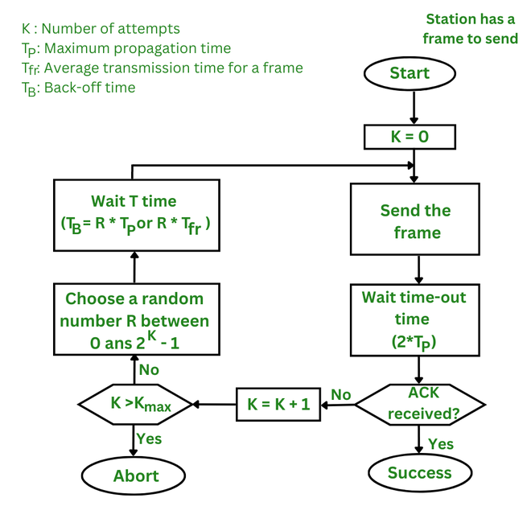
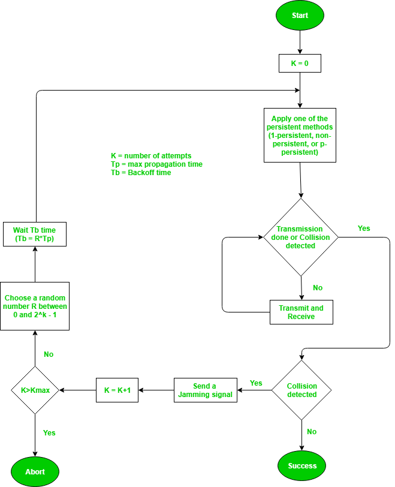
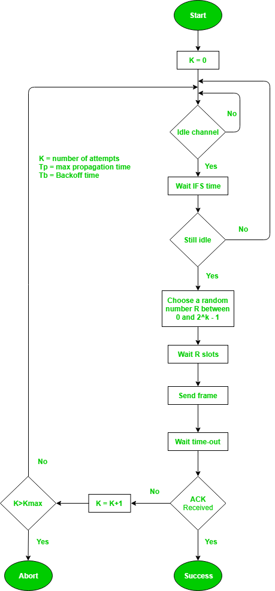

## The Medium Access Control Sub Layer:

- when multiple stations share same bus , to control mulyiple acesses MAC Sublayer is responsible.

1. Random acesses protocol :

   - when any station can share data at any time.
   - any size.
   - no priority .
2. Control acesses

In controlled access or Collision Free Protocols, the

stations consult one another to find which station has

the right to send. A station cannot send unless it has

been authorized by other stations.

3. Channelization protocol : 

## Aloha 

Aloha is a type of Random access protocol it was developed at the University of Hawaii in early 1970, it is a LAN-based protocol this type there are more chances of occurrence of collisions during the transmission of data from any source to the destination, Aloha has two types one Pure Aloha and another Slotted Aloha.

Vulnerable Period in ALOHA :

In ALOHA, the vulnerable period is the time during which a transmitted packet is susceptible to collision with other packets.

- Aggregate transmission rate (Poisson arrival rate) = 500 Frames/second.

=> G= 500*Tt = 25 

### PURE ALOHA

- Pure ALOHA refers to the original ALOHA protocol. The idea is that each station sends a frame whenever one is available. Because there is only one channel to share, there is a chance that frames from different stations will collide.
- The pure ALOHA protocol utilizes acknowledgments from the receiver to ensure successful transmission. 

Vulnerable time = 2 * Tt(Transmission Time)

- When two frames attempt to occupy the channel simultaneously, a collision occurs and both frames become garbled. If the first bit of a new frame overlaps with the last bit of a frame that is almost finished, both frames will be completely destroyed and will need to be retransmitted.
- To prevent this, the pure ALOHA protocol dictates that each user waits a random amount of time, known as the back-off time, before retransmitting the frame. This randomness helps to avoid further collisions.

- The time-out period is equal to the maximum possible round-trip propagation delay, which is twice the amount of time required to send a frame between the two most widely separated stations   (2 x Tp)(or vurnable time)

> Efficency OR Throughput = G*e^-2G.

For Max Efficency = d(n)/dG=0 ==> G=1/2 
>  G is defined as average no of frames generated by the system in one frame transmission time.

==> If half of the station will transmit data => min collision or max efficency=18.4%(1/2e)

### Slotted ALOHA

- divide into slots of Tt size.
- Every one can transmit at the begining og the Transmission.
- Vulnerable time = Tt(Transmission Time)

> Efficency = G*e^-G.

For Max Efficency = d(n)/dG=0 ==> G=1 ==> min collision or max efficency=36.8%(1/e)

## CSMA 

Carrier sense multiple acesses

- In this protocol, each device first sense the channel before sending the data. If the channel is busy, the device waits until it is free.

1. 1-persistant 

- continously checks if channel is free , if free sends data .

2. 0-persistant:

- waits for some random time before sending data after channel is free .

3. P-persistant  

- has p probability if it sends data after channel is free .

### CSMA/CD (wired)

- If A is transmitting data and recieves data also => collision has occured .
- > TT>= 2*PD , for collision detection.

> Efficency = 1/1+6.44a , a= PD/TT

Throughput and Efficiency: The throughput of CSMA/CD is much greater than pure or slotted ALOHA.  

For the 1-persistent method, throughput is 50% when G=1.

For the non-persistent method, throughput can go up to 90%.

- In wired networks, if a collision has occurred then the energy of the received signal almost doubles, and the station can sense the possibility of collision.

### CSMA/CA(with avoidance) (wireless)

- IFS time after if idle and again check if idle .
- Wait for random time here k=0 =>0 time at first 
- wait timeout 
- check `ack`
- In the case of wireless networks, most of the energy is used for transmission, and the energy of the received signal increases by only 5-10% if a collision occurs. It can’t be used by the station to sense collision. Therefore CSMA/CA has been specially designed for wireless networks. 
- InterFrame Space (IFS): When a station finds the channel busy it senses the channel again, when the station finds a channel to be idle it waits for a period of time called IFS time. IFS can also be used to define the priority of a station or a frame. Higher the IFS lower is the priority.
- Contention Window: It is the amount of time divided into slots. A station that is ready to send frames chooses a random number of slots as wait time.
- Acknowledgments: The positive acknowledgments and time-out timer can help guarantee a successful transmission of the frame.
- Binary Exponential Backoff: If a collision occurs, the device waits for a random period of time before attempting to retransmit. The backoff time increases exponentially with each retransmission attempt.

### Problems in CSMA/CA MAC protocol 

RTS -- request to send 

CTS -- Clear --

 

 

### Wireless LANs 

- short distance , wireless
- useful iff 
    - expensive wiring 
    - temporay acesses

### IEEE 802.11

- a/c Wireless LAN 
- uses CSMA/CA  MAC(Media acesses control)
- Frequency = 2.4Ghz and 5Ghz 
- Various specifications and amendments include 802.11a, 802.11b, 802.11e, 802.11g, 802.11n etc.

##### Architecture 

2 types :

1. BSS (Basic service Set) :

- if No Acesses point => Adhoc network eg : hotspot
- if AP => infrastructure Network eg: WiFi 

2. ESS (Extended service set):

- Combo of BSS using Distributed System

- Station: Stations (STA) comprise all devices and equipment that are connected to the wireless LAN. It can be of two types:

Wireless Access Point (WAP): WAPs or simply access points (AP) are wireless routers that bridge connections for base stations.

Client: Examples include computers, laptops, printers, and smartphones.

- Access Point: It is a device that can be classified as a station because of its functionalities and acts as a connection between wireless medium and distributed systems.

### IEEE 802.11 FRAME FORMAT 

| FRAME CONTROL | DURATION  | ADD-1 | ADD-2 | ADD-3 | SEQUENCE NUMBER | ADD-4 | DATA (0-2312) | CHECKSUM |
| ------------- | --------- | ----- | ----- | ----- | --------------- | ----- | ------------- | -------- |
| (2 Bytes)     | (2 Bytes) | (6)   | (6)   | (6)   | (2)             | (6)   | (0-2312)      | (4)      |

Frame control: 

### Explanation of Bits in the Protocol

| **Bit Field**        | **Size (in bits)** | **Explanation**                                                                      |
| -------------------- | ------------------ | ------------------------------------------------------------------------------------ |
| **Protocol Version** | 2 bits             | Indicates the version of the protocol being used. Typically set to `00` in 802.11.   |
| **Type**             | 2 bits             | Specifies the type of frame: Management (`00`), Control (`01`), or Data (`10`).      |
| **Subtype**          | 4 bits             | Provides additional information about the frame type, e.g., CTS, RTS, , Ack or Data. |
| **To DS**            | 1 bit              | Indicates if the frame is being sent to a Distribution System (DS).(AP also)         |
| **From DS**          | 1 bit              | Indicates if the frame is coming from a Distribution System (DS).                    |
| **More Flag**        | 1 bit              | Set to `1` if more fragments of the frame are expected.                              |
| **Retry**            | 1 bit              | Set to `1` if the frame is a retransmission of an earlier frame.                     |
| **Power Management** | 1 bit              | Indicates the power-saving mode of the device (`1` for sleep, `0` for active).       |
| **More Data**        | 1 bit              | Indicates if the access point has more data frames buffered for the device.          |
| **WEP**              | 1 bit              | Indicates if the frame is encrypted using Wired Equivalent Privacy (WEP).            |
| **Order**            | 1 bit              | Set to `1` if the frame is being sent using a strict order delivery mechanism.       |

---

| **Field**           | **Size**     | **Explanation**                                                                          |
| ------------------- | ------------ | ---------------------------------------------------------------------------------------- |
| **DURATION**        | 2 Bytes      | Specifies the duration of time (in microseconds) the medium will be reserved.            |
| **ADD-1**           | 6 Bytes      | Represents the **MAC address** of the receiver.                                          |
| **ADD-2**           | 6 Bytes      | Represents the **MAC address** of the transmitter.                                       |
| **ADD-3**           | 6 Bytes      | Typically contains the **BSSID** (Basic Service Set Identifier).                         |
| **SEQUENCE NUMBER** | 2 Bytes      | Used to uniquely identify each frame. Includes:                                          |
|                     |              | - **Sequence Number (12 bits)**: Identifies the order of frames in transmission.         |
|                     |              | - **Fragment Number (4 bits)**: Indicates the fragment number for the frame.             |
| **ADD-4**           | 6 Bytes      | Used only in specific cases (e.g., when frames travel between two distribution systems). |
| **DATA**            | 0-2312 Bytes | The actual payload of the frame, containing the data being transmitted.                  |
| **CHECKSUM**        | 4 Bytes      | A **Cyclic Redundancy Check (CRC)** used to detect errors in the frame.                  |

