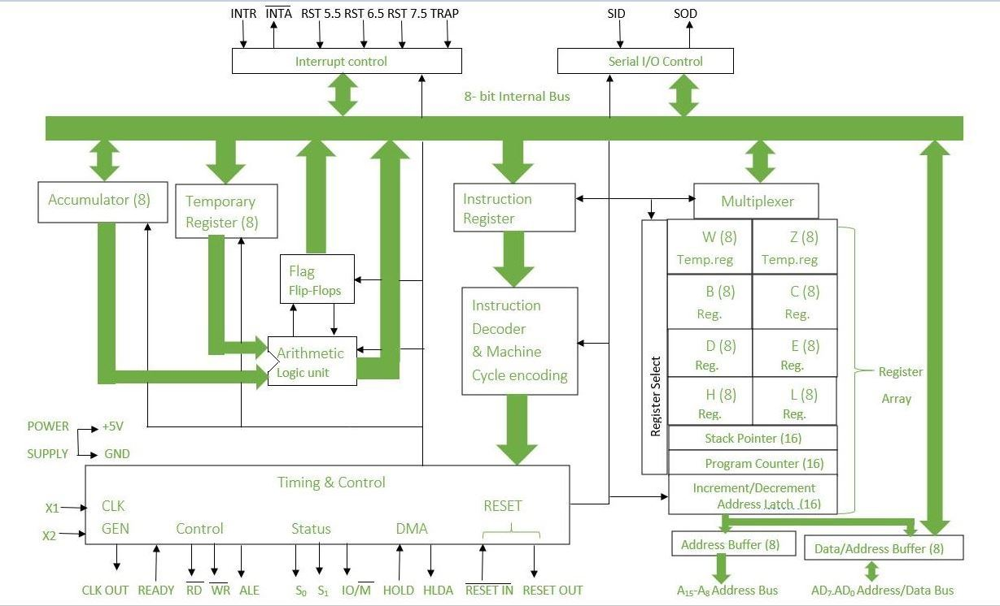

1. Draw and explain functional block diagram of 8085 microprocessor.

2. 
MVI A, Byte      ; Load the accumulator with a value (Byte)
ORA A            ; Perform logical OR of A with itself to check if A is zero
JM NEXT          ; Jump to label NEXT if the result is negative (MSB is 1)
OUT 80H          ; Output the value in A to port 80H
HLT              ; Halt the program
NEXT: CMA        ; Complement the accumulator (1's complement of A)
ADI 01H          ; Add 1 to the accumulator (2's complement of A)
OUT 80H          ; Output the new value of A to port 80H
HLT              ; Halt the program

Explanation of the Program
MVI A, Byte:

This instruction loads a value (Byte) into the accumulator (A).
ORA A:

Performs a logical OR operation of A with itself.
The operation updates the flags:
Zero Flag (Z): Set if A is zero.
Sign Flag (S): Set if the result is negative (MSB = 1).
This step is used to check whether the value in A is positive, zero, or negative.
JM NEXT:

JM (Jump if Minus) checks the Sign Flag (S).
If the value in A is negative (MSB = 1), the program jumps to the label NEXT.
If the Value is Positive or Zero:

OUT 80H: Outputs the value of A to the I/O port at address 80H.
HLT: Halts the program execution.
If the Value is Negative (NEXT Label):

CMA: Complements the accumulator, which flips all bits of A (1's complement).
ADI 01H: Adds 1 to the complemented value, effectively calculating the 2's complement (i.e., negating the value in signed arithmetic).
OUT 80H: Outputs the new (positive) value of A to the I/O port at address 80H.
HLT: Halts the program execution.
Function of the Program
The program takes a signed value (Byte) as input and determines whether it is positive or negative:
If the value is positive or zero, it outputs the original value to port 80H.
If the value is negative, it calculates the 2's complement (converts it to its positive equivalent) and outputs this positive value to port 80H.

Example Execution
Input 1: Byte = 05H (positive value)
ORA A: Result is positive (S = 0).
Output: 05H is sent to port 80H.
Program halts.

Input 2: Byte = F5H (negative value; in 2's complement, this represents -11 in decimal)
ORA A: Result is negative (S = 1), jumps to NEXT.
CMA: 1's complement of F5H is 0AH.
ADI 01H: Adding 1 results in 0BH (11 in decimal).
Output: 0BH is sent to port 80H.
Program halts.

3. 
MVI A, 9FH      ; Load accumulator with 9FH
ADI 82H         ; Add 82H to the accumulator
JC Display      ; Jump to 'Display' if carry is set
OUT PORT1       ; Output the value of A to PORT1
HLT             ; Halt the program
Display: 
XRA A           ; Clear accumulator (A = 00H)
OUT PORT1       ; Output 00H to PORT1
HLT             ; Halt the program
-
- This result exceeds 8 bits, so the **Carry Flag** is set, and only the lower byte (`21H`) is stored in `A`.

4. 
MVI A, BYTE1    ; Load accumulator with BYTE1
MOV B, A        ; Copy the value of A into B
SUI 60H         ; Subtract 60H from A
JC DELETE       ; Jump to DELETE if carry is set
MOV A, B        ; Restore the original value of BYTE1
SUI 90H         ; Subtract 90H from A
JC DISPLAY      ; Jump to DISPLAY if carry is set
DELETE: 
XRA A           ; Clear accumulator (A = 00H)
OUT PORT1       ; Output 00H to PORT1
HLT             ; Halt the program
DISPLAY: 
MOV A, B        ; Load original BYTE1 into A
OUT PORT2       ; Output the value of A to PORT2
HLT             ; Halt the program

- Range of Bytes Displayed at PORT2:

60H to 8FH (inclusive)

5. 
