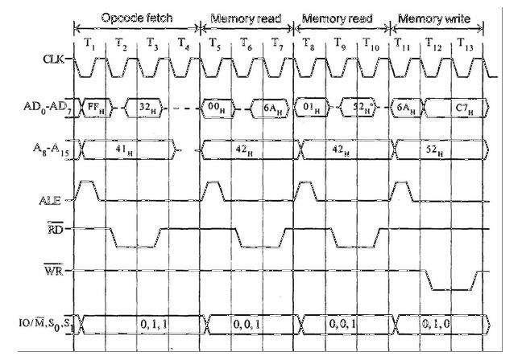
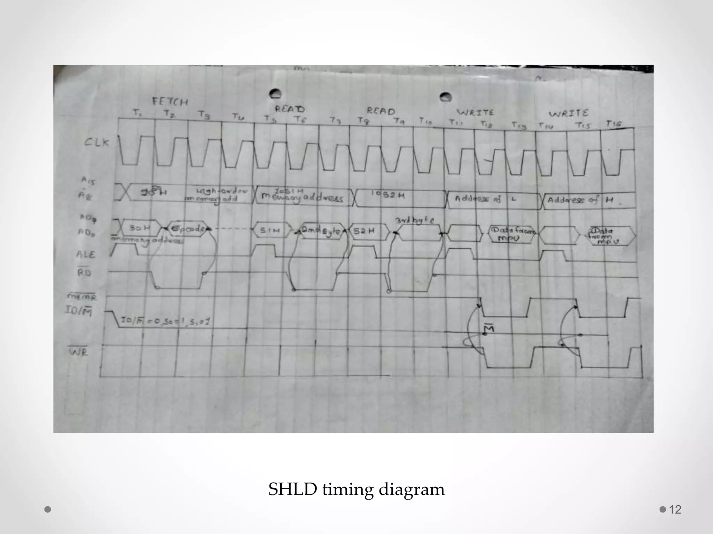

| Instruction      | Opcode | Operation                      |
| ---------------- | ------ | ------------------------------ |
| MOV A, B         | 78     | Copy contents of B to A        |
| MVI A, 8-bit     | 3E     | Load immediate 8-bit data to A |
| LDA 16-bit addr  | 3A     | Load accumulator from memory   |
| STA 16-bit addr  | 32     | Store accumulator to memory    |
| LHLD 16-bit addr | 2A     | Load H-L pair from memory      |
| SHLD 16-bit addr | 22     | Store H-L pair to memory       |
| XCHG             | EB     | Exchange contents of HL and DE |
| LXI              | 01H    |                                |

| **Operation**         | **IO/M̅** | **RD̅** | **WR̅** | **S1** | **S0** | **INTA̅** | **T-States** |
| --------------------- | -------- | ------ | ------ | ------ | ------ | -------- | ------------ |
| Opcode Fetch          | 0        | 0      | 1      | 1      | 1      | 1        | 4 / 6        |
| Memory Read           | 0        | 0      | 1      | 1      | 0      | 1        | 3            |
| Memory Write          | 0        | 1      | 0      | 0      | 1      | 1        | 3            |
| I/O Read              | 1        | 0      | 1      | 1      | 0      | 1        | 3            |
| I/O Write             | 1        | 1      | 0      | 0      | 1      | 1        | 3            |
| Interrupt Acknowledge | 1        | 1      | 1      | 1      | 1      | 0        | 3 or 6       |
| Bus Idle              | 0        | 1      | 1      | 0      | 0      | 1        | 3            |

# Fetch

¶ Since it is a memory operation, IO/M goes low.

¶ It is a compulsory Machine Cycle

¶ `T4` state is used by the µP to decode the Opcode.

# Memory Read

¶ A15-A8 contains the higher byte of the address (PCH)

¶ As ALE is high, AD7-AD0 contains the lower byte of the address (PCL).

¶ Since it is a Memory Read cycle, S1 goes high.(s1s0 == 11(fetch) , 10(read) , 01(write))

¶ Since it is a memory operation, IO/M goes low

# Timing Diagram of MVI 

4T(Fetch)+3T(Read)

 J

- 2000 = MVI (3E) --->Fetch opcode => 4T cycles
- 2001 = 23 (data to move to Accumulator) ---> Memory Read => 3T cycles
- T1: ALE goes high to latch the lower-order address.

Address is placed on A8-A15 and AD0-AD7.

- T2: RD goes low to read the opcode.

The opcode appears on AD0-AD7.

A(15)-A(8) ==> 20 throughout excet t4 unspecified bcx Decoding

Ad(7)-Ad(0) ==> 00 also stores the data 3E(opcode) after T1 && 01 after T4 & 23 after T5 

ALE (Address Latch Enabler ) ==> Active at T1 & T5 for Loading rest 2bits of address only. 

RD(bar) ==> 1 Throughout , except at loadings of data ie at T2 and T5

# Timing Diagram of STA

4T(Fetch)+3T(M read)+3T(M read)+3T(M write) = 13T

Eg : STA 3000H

- T1T2T3T4 ==> Fetch A15-A8 = 20(Higher Address of STA Instruction)

 A7-A0 = 00(Lower Address of STA Instruction)

- T5T6T7 ==>  PC=PC+1 ie A7-A0=01 + Read  lower add of 3000H ie 00
- T8T9T10 ==>  PC=PC+1 ie A7-A0=02 + Read Higher add of 3000H ie 30
- T11T12T13 ==>  A15-18=30 && A7-A0=00    + A7-A0 = data in accumulator after T11  + WRbar low

| **Machine Cycle** | **Address Bus** | **Data Bus**                 | **T-States** |
| ----------------- | --------------- | ---------------------------- | ------------ |
| Opcode Fetch      | PC              | Opcode (32H)                 | 4            |
| Memory Read       | PC + 1          | 00H (Lower byte of address)  | 3            |
| Memory Read       | PC + 2          | 30H (Higher byte of address) | 3            |
| Memory Write      | 3000H           | A (Accumulator value)        | 3            |
| **Total**         | -               | -                            | **13**       |

STA 526AH

# LXI B ,3000H

# LDA 2000H

fetch PC OPCODE
read  PC+1 00
read  PC+2 20
read  2000 [accumulator]
+3T for Memory Read  2000   [2000]   3TCC   Like in STA 3000H

# SHLD 5140H

L -> [5140H], H -> [5141H]

| **Machine Cycle** | **Address Bus** | **Data Bus**                | **T-States** |
| ----------------- | --------------- | --------------------------- | ------------ |
| Opcode Fetch      | PC              | Opcode (22H)                | 4            |
| Memory Read       | PC + 1          | 40 (Lower byte of address)  | 3            |
| Memory Read       | PC + 2          | 51 (Higher byte of address) | 3            |
| Memory Write      | 5140H           | L (Value in L register)     | 3            |
| Memory Write      | 5141H           | H (Value in H register)     | 3            |
| **Total**         | -               | -                           | **16**       |

# LHLD 2000H

L <- [2000H], H <- [2001H]

| **Machine Cycle** | **Address Bus** | **Data Bus**                | **T-States** |
| ----------------- | --------------- | --------------------------- | ------------ |
| Opcode Fetch      | PC              | Opcode (3AH)                | 4            |
| Memory Read       | PC + 1          | 00 (Lower byte of address)  | 3            |
| Memory Read       | PC + 2          | 20 (Higher byte of address) | 3            |
| Memory Read       | 2000H           | [2000H] (Data)              | 3            |
| Memory Read       | 2001H           | [2001H] (Data)              | 3            |
| **Total**         | -               | -                           | **16**       |