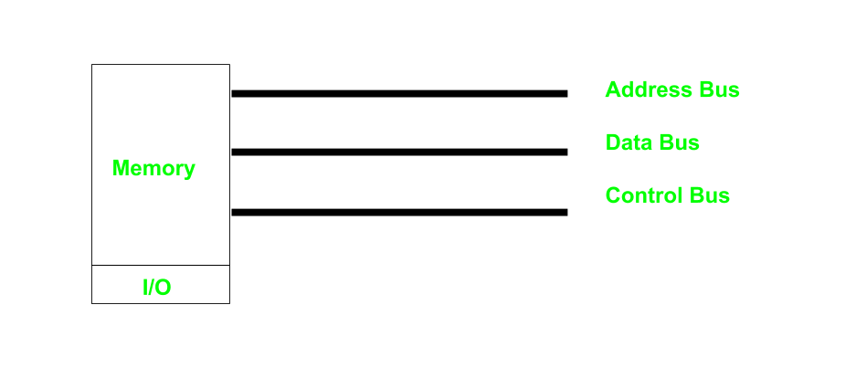
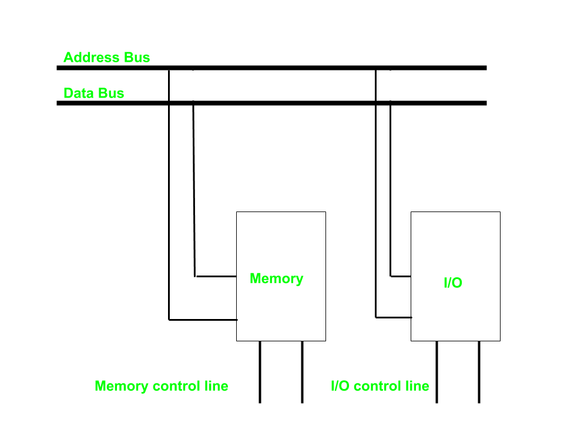

## 8085 Interrupts

In the 8085 microprocessor, an interrupt is a signal that temporarily suspends the normal execution of a program and redirects the control to a specific interrupt service routine (ISR). Interrupts allow the microprocessor to respond to external events, such as user input, system events, or hardware signals, without the need for constant polling.

There are five interrupt signals in the 8085 microprocessor:

1. **TRAP**: The TRAP interrupt is a non-maskable interrupt that is generated by an external device, such as a power failure or a hardware malfunction. The TRAP interrupt has the `highest` priority and cannot be disabled.
2. **RST 7.5**: The RST 7.5 interrupt is a maskable interrupt that is generated by a software instruction. It has the second highest priority.
3. **RST 6.5**: The RST 6.5 interrupt is a maskable interrupt that is generated by a software instruction. It has the third highest priority.
4. **RST 5.5**: The RST 5.5 interrupt is a maskable interrupt that is generated by a software instruction. It has the fourth highest priority.
5. **INTR**: The INTR interrupt is a maskable interrupt that is generated by an external device, such as a keyboard or a mouse. It has the lowest priority and can be disabled.

> When microprocessor receives any interrupt signal from peripheral(s) which are requesting its services, it stops its current execution and program control is transferred to a sub-routine by generating **CALL** signal and after executing sub-routine by generating **RET** signal again program control is transferred to main program from where it had stopped. When microprocessor receives interrupt signals, it sends an acknowledgement (INTA) to the peripheral which is requesting for its service.

## Memory mapped I/O

Memory Mapped I/O is a technique in which an I/O device is mapped as memory itself. In this approach, memory and I/O devices occupy the `same space` as far as the system is concerned. This implies that the CPU can transmits or receive data from I/O devices using the same format that is used to address normal memory.

• They are assigned with 16-bit address values.	

• The instruction used are LDA and STA, etc.

• Intel 8085, Motorola 6800 	

• Any register can communicate with the IO device in case of Memory Mapped IO.	

**Characteristics of Memory Mapped I/O**

- Shared Address Space: I/O devices are carved out a particular memory space.
- Unified Instructions: They are identical for both memory and I/O operations.
- Simplified Addressing: This means there is no need for special instructions and port for I/O operations as in integrated I/O.

**Advantages of Memory Mapped I/O**

• Faster Access: Because a memory has faster access times then an I/O operation can have improved access times as well.

• Flexible Addressing: Supports all the addressing modes of the CPU hence making it easier to write programs.

• Simplified Programming Model: Unlike other instruction types, where the Developer requires a special kind of instruction called I/O instruction, they are free to use what is called memory instruction.

## I/O Mapped I/O

I/O Mapped I/O known as `Port Mapped I/O` or `Isolated I/O` uses dedicated address space for the installation of I/O devices. This method employs specific port commands by which it addresses `I/O ports` hence enhancing the segregation between memory and ports.

• Each I/O device is assigned an 8-bit port address, which allows for 256 I/O devices.

• The instruction used are IN and OUT.

• Only Accumulator can communicate with IO devices in case of IO Mapped IO.

• Intel 8255, Zilog Z80

**Advantages of I/O Mapped I/O**

• Separate Address Space: I/O devices are granted their own address space that is independent of the memory space of the computer.

• Dedicated Instructions: Contains specific I/O instructions known as `IN` and `OUT`.

• Distinct Port Addresses: I/O devices are connected to the computer and can only be addressed by specific port addresses.

## Types of Interfacing Devices:

1. **I/O Ports (Input/Output Ports)**

I/O ports are used to interface simple peripherals (e.g., LEDs, switches) directly with the microprocessor.

Functions:

• Send data to output devices (e.g., display, motors).

• Receive data from input devices (e.g., keyboards, sensors).

Examples: 8-bit I/O port chips like 8255 or GPIO ports on microcontrollers.

2. **Programmable Peripheral Interfaces (PPIs)**

These are specialized ICs designed to handle specific I/O operations. Below are some widely used peripherals for the 8085 and other microprocessors.

> Intel 8255 – Programmable Peripheral Interface (PPI)

Features:

• Can operate in input or output modes.

• Ports can be split into smaller bit groups.

• Can handle handshake signals for synchronous communication.

Applications: Used for controlling displays, keyboards, relays, or other I/O devices.

> Intel 8259 – Programmable Interrupt Controller (PIC)

Features:

Can handle `8` interrupt requests; supports cascading for up to 64 interrupts.

Allows both maskable and non-maskable interrupts.

Helps in interrupt priority management.

Applications: Used in systems requiring multiple interrupt sources, such as real-time applications and multi-tasking environments.

> Intel 8251 – Programmable USART (Universal Synchronous/Asynchronous Receiver/Transmitter)

Features:

Supports both synchronous and asynchronous communication.

Configurable baud rate, data bits, parity, and stop bits.

Used in UART protocols to communicate with serial devices.

Applications:

Used in RS232 serial communication with terminals, modems, or other microprocessor systems.

> Intel 8253 – Programmable Interval Timer

Features:

Three 16-bit counter/timers, each programmable in different modes (e.g., one-shot, square wave, rate generator).

Can be used to generate clock signals or measure time intervals.

Applications:

Used for generating clock pulses, delays, and timing operations in embedded systems.

> Intel 8279 – Programmable Keyboard and Display Controller

Features:

Can interface with matrix keyboards (up to 64 keys).

Manages LED or 7-segment displays.

Provides features like debouncing and key scanning.

Applications:

Used in keypad and display interfacing, such as ATMs, vending machines, and calculators.

Device	Function	                Key Features	                                  Applications

8255	Parallel I/O interface      3 8-bit ports (A, B, C)	                        Display, relays, switches

8259	Interrupt controller	    8 interrupts, priority management	            Real-time systems, multi-tasking

8251	Serial communication	    Synchronous/Asynchronous modes	                UART, RS232 communication

8253	Timer	                    3 16-bit timers                                	Clock generation, delays

8279	Keyboard/Display controller	Key scanning, debounce handling                 Keypads, 7-segment displays

8087    Coprocessor	Math processor	Floating-point arithmetic                       Scientific computations