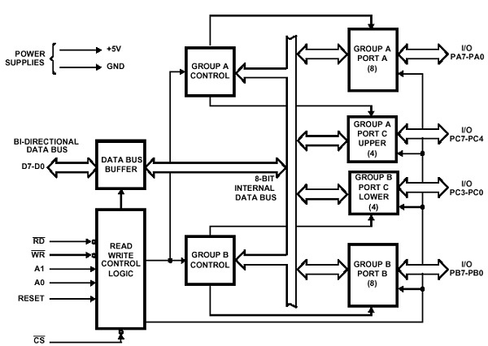

### PPI 8255 

is a general purpose programmable I/O device designed to interface the CPU with its outside world such as ADC, DAC, keyboard etc. 

- We can program it according to the given condition. It can be used with almost any microprocessor. 
- It consists of three 8-bit bidirectional I/O ports i.e. PORT A, PORT B and PORT C. We can assign different ports as input or output functions.

- PA7 to PA0 (PortA Pins)

The PA7 to PA0 are Port A data lines pins (1 to 4 & 37 to 40) which are distributed equally on two sides of the top of the microprocessor. These eight port A pins work as either buffered input lines or latched output based on the loaded control word into the control word register.

- PB0 to PB7 (Port B Pins)

The PB0 to PB7 from 18 to 25 are the data line pins that carry the port B data.

- PC0 to PC7 (Port C Pins)

PC0 to PC7 pins are port C pins which include pin10 to pin17 which carry the port A data bits. From there, pins 10 – pin13 are known as Port C upper pins & pin14 to pin17 are known as lower pins. The pins from these two sections can be used individually to transmit 4 data bits using two separate port C parts.

- D0 to D7 (Data bus pins)

These D0 to D7 pins are data I/O lines which include 27-pin to 34-pin. These pins are used to carry the 8-bit binary code and it is utilized to train the entire IC work. These pins are jointly known as the control register/control word which carries the data of the control word.

- A0 & A1

A0 and A1 pins at pin8 & pin9 simply make a decision about which port will be preferred for transmitting the data.

If A0 = 0 & A1=0 then Port-A is selected.

If A0 = 0 & A1=1 then Port-B is selected.

If A0 = 1 & A1=0 then Port-C is selected.

If A0 = 1 & A1=1 then the control register is selected.

- CS’

The pin6 like CS’ is a chip select input pin which is responsible for selecting a chip. A `low` signal at CS’ pin simply allows the communication between the 8255 & the processor which means at this pin, the operation of data transfer gets allowed by an active low signal.

- RD’

The pin5 like RD’ is a read input pin that puts the chip within the reading mode. A low signal at this RD’s pin provides data to the CPU by a data buffer.

- WR’

The pin36 like WR’ pin is a write input pin that puts the chip within writing mode. So, a low signal at WR’ pin simply allows the CPU to execute the write operation above the ports otherwise microprocessor’s control register through the data bus buffer.

- RESET

The pin35 like the RESET pin resets the whole data available in all the keys to their default values when it is in set mode. It is an active high signal where the high signal at the RESET pin clears the control registers &the ports are placed within the input mode.

- GND

The pin7 is a GND pin of IC.

- VCC

The pin26 like VCC is the 5V input pin of IC.

