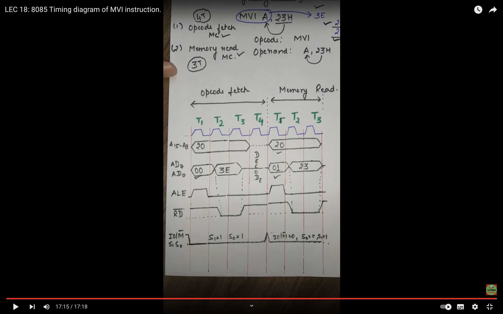

# Timing Diagram of MVI

- 2000 = MVI (3E) --->Fetch opcode => 4T cycles
- 2001 = 23 (data to move to Accumulator) ---> Memory Read => 3T cycles

A(15)-A(8) ==> 20 throughout excet t4 unspecified bcx Decoding
Ad(7)-Ad(0) ==> 00 also stores the data 3E(opcode) after T1 && 01 after T4 & 23 after T5 
ALE (Latch Enabler ) ==> Active at T1 & T5 for Loading data 
RD(bar) ==> 1 Throughout , except at loadings ie T2 and T5

# Timing Diagram of STA

