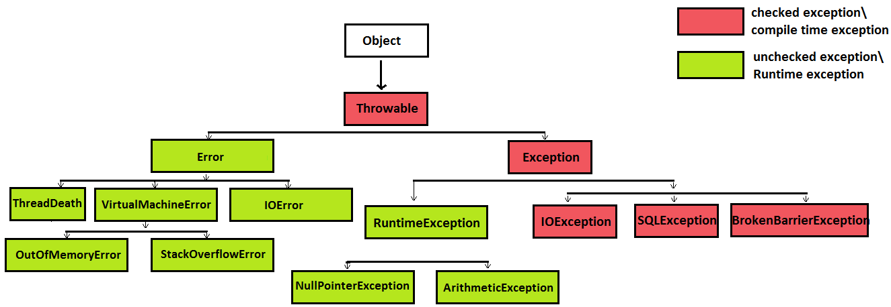
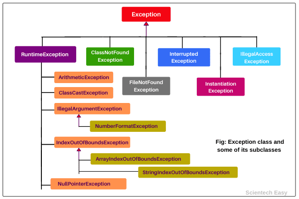

## Does Every Class in Java Have a toString() Method?
Yes, every class in Java has a toString() method. This method is inherited from the Object class, which is the superclass of all Java classes. The Object class defines a default implementation of toString() that returns a string representation of the object, typically in the format of:
- className@762efe5d // originally
- @Override
    public String toString() {
        return "Person{name='" + name + "', age=" + age + "}";
    }

## The final keyword in Java is used to define constants, prevent inheritance, and ensure that methods or variables cannot be modified.

## The Throwable class is the super class for all types of errors and exceptions in Java. It is a part of the java.lang package and has two direct subclasses:

Error: Represents serious problems that a reasonable application should not try to handle (e.g., OutOfMemoryError).
Exception: Represents conditions that a reasonable application might want to catch and handle (e.g., IOException, ArithmeticException).

##

