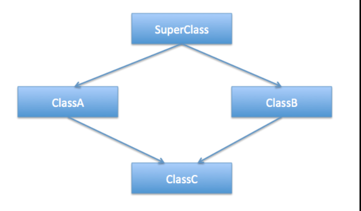

# Derived class 
class DerivedClassName : AccessSpecifier BaseClassName {};
-- pointer->display();
   obj.display();

# Forms of Inheritance
## Single Inheritance
A class inherits from a single base class.

## Multiple Inheritance
A class inherits from more than one base class.
### Diamond Problem

## Multilevel Inheritance
A class is derived from another derived class.

### Constructors and Destructors in Derived Classes
`Order of Constructor Calls:`
- Base class constructors are called before derived class constructors.
- For multiple inheritance, base class constructors are called in the order of inheritance.
`Order of Destructor Calls:`
- Derived class destructors are called first, followed by base class destructors.

## Hierarchical Inheritance
Multiple classes inherit from a single base class.

## Hybrid Inheritance
A combination of two or more types of inheritance.
May introduce ambiguity, resolved by using virtual inheritance.

### Inheritance Problem in C++
           +----------------+        +----------------+
           |     Base       |        |     Base2      |
           |  baseMethod()  |        |  baseMethod()  |
           +----------------+        +----------------+
                |                                    |
                |                                    |
     +----------------+                 +----------------+    
     |  Intermediate1 |                 |  Intermediate2 |    
     |    (Base)      |                 |   (Base2)      |    
     +----------------+                 +----------------+    
         \                                 /
          \                               /
           \                             /
                  +-----------------+
                  |     Derived     |
                  |  Ambiguity in   |
                  |  baseMethod()   |
                  +-----------------+
sol :      d.Base::baseMethod(); 
           d.Base2::baseMethod(); 

# Types of Inheritance
1. Public Inheritance
Public members of the base class remain public in the derived class.
Protected members of the base class remain protected in the derived class.

2. Protected Inheritance
Public and protected members of the base class become protected in the derived class.

3. Private Inheritance
Public and protected members of the base class become private in the derived class.

## Abstract Class
An abstract class is a class that cannot be instantiated directly. It serves as a blueprint for other classes. 
- It can include both abstract methods (methods without a body) and concrete methods (methods with a body). Abstract classes are used to define a common interface for its subclasses while providing some common functionality.
- in unit 1

## virtual Destructor 
This ensures that when a base class pointer or reference is used to delete an object, the destructor of the derived class is also called.

## Rules for Writing Virtual Functions in C++
Virtual functions enable runtime polymorphism, allowing a derived class to override a base class function. When writing virtual functions, it is essential to follow these rules and guidelines:
1. A virtual function must be explicitly declared with the virtual keyword in the base class.
2. Only member functions of a class can be declared as virtual.
Non-member functions (e.g., global or static functions) cannot be virtual.
3. Virtual functions exhibit `late bindin`g, where the function to be called is determined at runtime based on the actual type of the object, not the type of the pointer or reference.
4. Constructors Cannot Be Virtual
Constructors cannot be declared virtual because they are not inherited and are called based on the type of object being constructed.
5. Virtual Functions Can Be Made = 0 (Pure Virtual)
