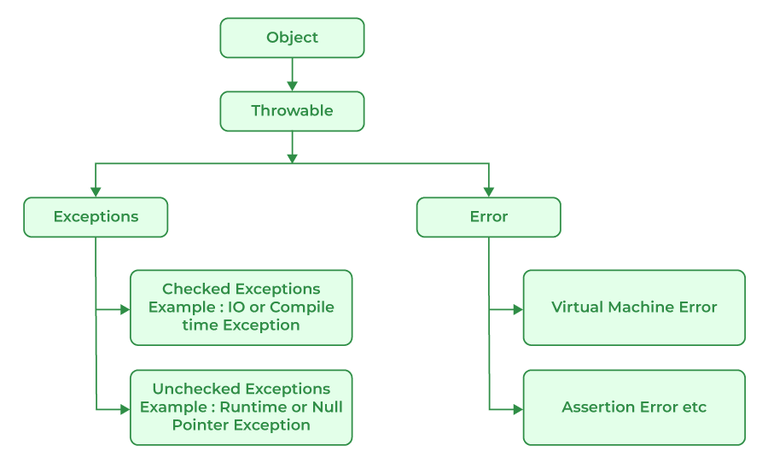

# Java Exceptions 
- When executing Java code, different errors can occur: coding errors made by the programmer, errors due to wrong input, or other unforeseeable things.
When an error occurs, Java will normally stop and generate an error message. The technical term for this is: Java will throw an exception (throw an error).

 ## try and catch 
- The try statement allows you to define a block of code to be tested for errors while it is being executed.

- The catch statement allows you to define a block of code to be executed, if an error occurs in the try block.

- The try and catch keywords come in pairs:
try {
  //  Block of code to try
}
catch(Exception e) {
  //  Block of code to handle errors
}

- finally executes after try and catch.

## throw 
The throw statement allows you to create a custom error.

- The throw statement is used together with an exception type. 
- There are many exception types available in Java: 
ArithmeticException, FileNotFoundException, ArrayIndexOutOfBoundsException, SecurityException, etc:

